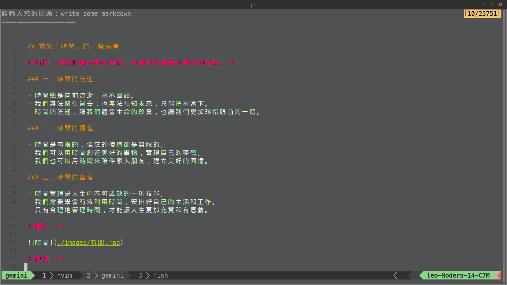
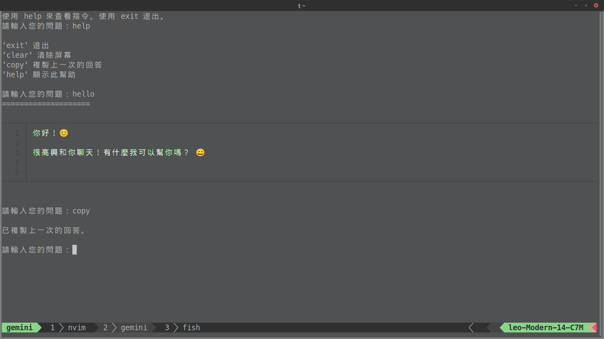

# gemini-sh 

Chat with Gemini in your terminal

A simple shell script for using gemini api in your terminal. Chat like you're in the web browser.

## Features

- Use Gemini API in your terminal, with a chat-like interface
- Store chat history in txt for better conversation context
- Syntax highlighting response using [`bat`](https://github.com/sharkdp/bat) command
- Quick copy last response with `xclip`
- Easy for configuring system prompt and prompt for every request

## Screenshot




## How to use

1. Clone the repository
```bash
git clone https://github.com/ascodeasice/gemini-sh.git
cd gemini-sh
```

2. Create api key file
```bash
echo "YOUR_API_KEY" >> gemini_api_key.txt # replace YOUR_API_KEY with your api key
```

3. Make the script executable
```bash
chmod +x gemini.sh
```

4. Configure the script (optional)

5. Run the script
```bash
./gemini.sh
```


## Dependencies (optional)

- [`bat`](https://github.com/sharkdp/bat?tab=Apache-2.0-1-ov-file) for syntax highlight output
- xclip for copy last response

    ```bash
    sudo apt install xclip
    ```

## Variables

- `USE_BAT`: output with `bat` command
- `MODEL`: which Gemini model to use
- `SYSTEM_PROMPT`: system prompt that is added before every API request
- `QUESTION_POSTFIX`: text that is added after every new question

## Contributing

Contributions to this script are welcome! Please open an issue or a pull request on te GitHub repository.

## License

Tis script is licensed under the MIT License.
