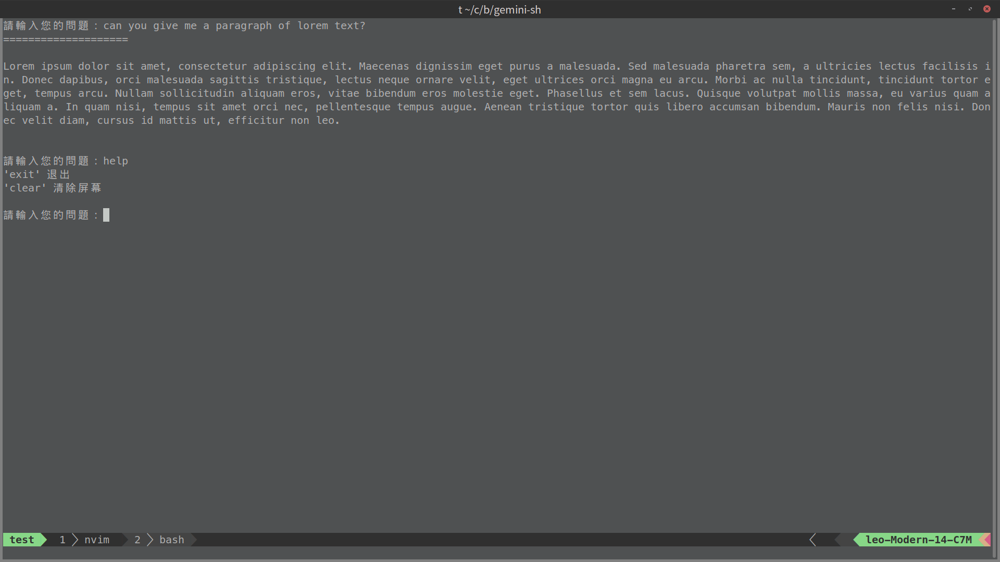

# gemini-sh 

Chat with Gemini in your terminal

A simple shell script for using gemini api in your terminal. Chat like you're in the web browser.

## Screenshot




## How to use

1. Clone the repository
```bash
git clone https://github.com/ascodeasice/gemini-sh.git
cd gemini-sh
```

2. Create api key file
```bash
echo "YOUR_API_KEY" >> gemini_api_key.txt # replace YOUR_API_KEY with your api key
```

3. Make the script executable
```bash
chmod +x gemini.sh
```

4. Run the script
```bash
./gemini.sh
```


## Contributing

Contributions to this script are welcome! Please open an issue or a pull request on te GitHub repository.

## License

Tis script is licensed under the MIT License.
